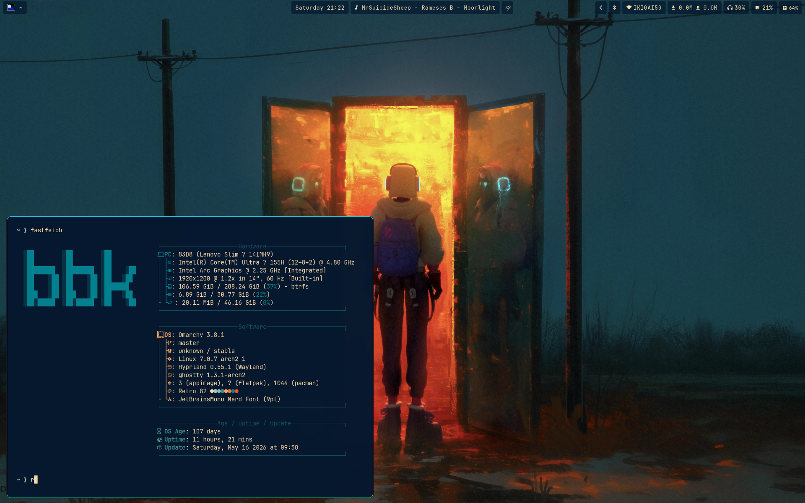
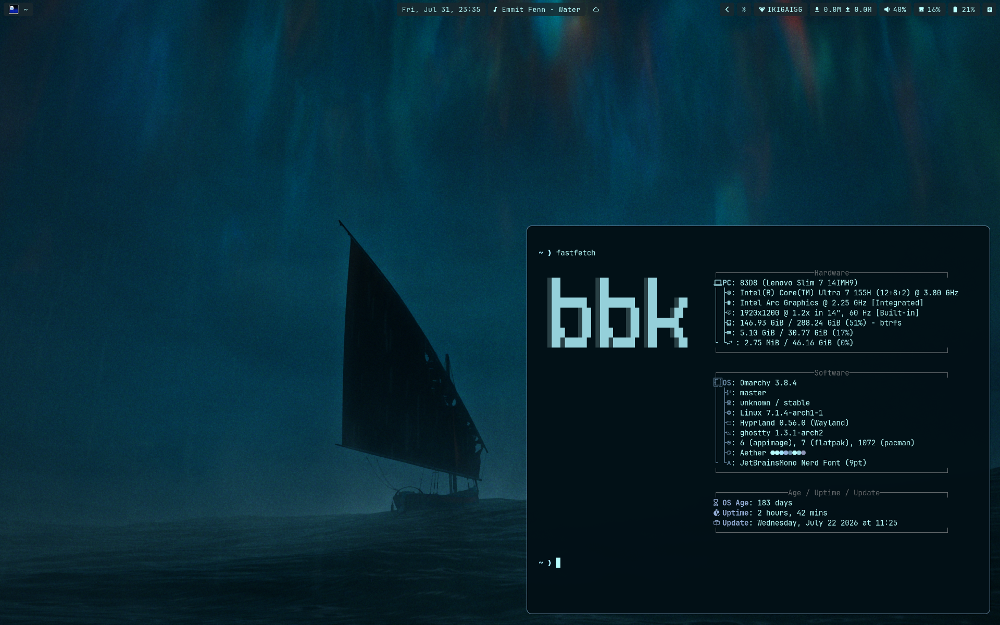
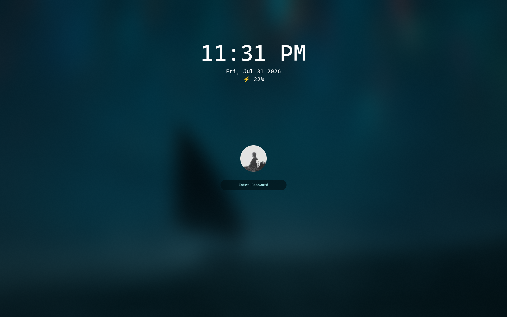

# bbk's Omarchy Setup

> A curated layer of customizations on top of [Omarchy Linux](https://omarchy.org/) by DHH —
> daily-driving Arch + Hyprland without the rough edges.



|  |  |
|:---:|:---:|
| Northern lights wallpaper → full color system | Lock screen: clock, date, battery, fingerprint |

---

## Why this exists

Stock Omarchy is already great. This setup makes it *feel like yours* — wallpaper-aware colors everywhere, smarter battery life, better gestures, a status bar that actually earns its screen real estate, and a few quality-of-life fixes that remove friction from daily use.

Every change lives in `~/.config/` and **survives `omarchy update`** via a post-update hook.

---

## What you get

### 🎨 One wallpaper. Every color. Everywhere.

Right-click any image in Nautilus → **Set as Background** → your entire desktop recolors itself.

<video src="images/wallpaper-demo.mp4" autoplay loop muted playsinline></video>

Aether extracts a 16-color palette from the image and propagates it to:

| Surface | What changes |
|---------|-------------|
| Hyprland borders | Active/inactive colors from the accent hue |
| Waybar pills | Background adapts to wallpaper brightness at the top of screen |
| Lock screen | Background, text, and input field colors |
| Mako notifications | Border and background colors |
| SwayOSD | Volume and brightness overlay colors |
| Terminals | Full 16-color ANSI palette (alacritty, ghostty, kitty, foot) |
| btop | Resource monitor theme |
| VSCode / Cursor | Matching color theme installed and activated |
| Obsidian / Zed / Browser | Accent and background synced |

The Waybar pill background is especially smart: it measures the **luminosity of the top 60px strip** of your wallpaper and picks a readable background — dark tinted pill on bright wallpapers, softer background on dark ones. No more unreadable white text on a white sky.

> **Under the hood:** Nautilus 50 uses the XDG Desktop Portal to change wallpapers, but Hyprland ships no Wallpaper portal backend. This setup adds one — a small Python D-Bus service that intercepts the call and routes it through the color pipeline.

---

### 🔋 Serious battery management

Three power modes, one keybind (`Super+Shift+P`):

| Mode | CPU max | GPU max | Profile |
|------|---------|---------|---------|
| Default | Unrestricted | Unrestricted | balanced |
| Powersave | 800 MHz | 400 MHz | low-power |
| Performance | Unrestricted + turbo | Unrestricted | performance |

TLP is tuned with aggressive power saving defaults: PCI Express ASPM `powersupersave`, SATA link power, platform profile. The active mode persists across reboots — wake up in powersave, stay in powersave.

Kernel-level tuning too: `vm.swappiness=10` (less swap thrashing on 30GB RAM) and `transparent_hugepage=madvise` to kill random CPU spikes.

#### Known gaps / planned improvements

| # | What | Why it matters | Notes |
|---|------|----------------|-------|
| 1 | **WiFi power save is off on battery** | ~0.5–1W wasted when WiFi is idle | `iw dev wlan0 get power_save` returns `off`. TLP default enables it (`WIFI_PWR_ON_BAT=on`) but the wake-from-suspend WiFi fix script overrides it. Fix: add `WIFI_PWR_ON_BAT=on` to `99-battery.conf` and audit `system-tweaks` to not permanently disable power save. |
| 2 | **Battery conservation mode disabled** | Long-term capacity loss | `ideapad_laptop` driver exposes `/sys/devices/.../VPC2004:00/conservation_mode` (currently `0`). Enabling it caps charge at ~60%, preventing degradation while plugged in. 413 cycles already. TLP charge threshold sysfs nodes not present on this kernel; use conservation_mode directly or a systemd unit. |
| 3 | **CPU min frequency not pinned** | Marginal idle waste | `CPU_SCALING_MIN_FREQ_ON_BAT/SAV=400000` not set. `intel_pstate` defaults to `min_perf_pct=8%` which is fine, but explicitly setting the floor prevents the scheduler from briefly ramping idle cores. |
| 4 | **`s2idle` suspend instead of `deep` (S3)** | 1–3W draw during lid-closed suspend | `/sys/power/mem_sleep` shows only `[s2idle]` (Intel modern standby). `deep` S3 would drop to ~0.3W. Check BIOS → Power → Sleep State for S3 option — many Lenovo Slim BIOSes have it disabled by default. If enabled, set `MEM_SLEEP_ON_BAT=deep`. Tradeoff: slightly slower wake. |

---

### ✋ Touchpad that gets out of your way

| Gesture | Action |
|---------|--------|
| 3-finger swipe left/right | Switch workspaces |
| 4-finger swipe up/down | Volume up/down |
| Natural scroll | On by default |

Scroll factor, tap-to-click, and drag latency all tuned for a 13" laptop.

---

### 💊 Waybar that earns its 30px

Stock Omarchy's bar is minimal. This one carries its weight:

```
[  Window title                    ] [media] [bt] [🔔] [ net ] [mem] [⚡] [🔋] [tray]
```

- **Window title** in the left — always know what's focused
- **Media module** — current track + playback controls, hidden when nothing's playing
- **Bluetooth** — live on/off state with toggle
- **Notification counter** — unread count with Mako integration  
- **Net speed** — live upload/download in the tray area
- **Power mode indicator** — icon changes with the active TLP mode; tooltip shows actual screen-on time since last unplug (excludes sleep/idle, like Android SOT)
- **Battery** — percentage + charging state, color-coded (charging=green, full=blue)
- **Each module is a floating pill** — semi-transparent, 8px radius, wallpaper-aware background color

---

### 🔔 Notifications that look right

Mako notifications match the window border radius (8px rounded corners). Click to act on a notification (e.g. open screenshot in editor), right-click to dismiss instantly. Colors (border, background) are wallpaper-derived like everything else.

---

### 🔒 Lock screen worth looking at

Clock, date, and battery percentage displayed. Fingerprint authentication works out of the box. Screen never auto-locks mid-video — locking is always intentional (`Ctrl+L`).

Custom TTE screensaver (`Ctrl+Super+S`) fades into the lock screen on exit rather than cutting hard.

---

### ⌨️ Keybinds that make sense

| Keybind | Action |
|---------|--------|
| `Super+Q` | Close window |
| `Super+L` | System menu (lock/shutdown/reboot) |
| `Super+E` | File manager |
| `Super+;` | Emoji picker |
| `Super+Shift+S` | Screenshot |
| `Super+Shift+R` | Screen recording |
| `Super+Shift+P` | Cycle power mode |
| `Super+Shift+B` | Browser |
| `Super+Shift+M` | Music (Spotify) |
| `Super+Shift+N` | Editor |
| Brightness keys | 1% precision steps |
| Volume keys | 5% steps via SwayOSD |

---

### 🖥️ The small things that add up

- **Afterglow cursor theme** — sleek dark cursor that doesn't disappear on light backgrounds
- **Bluetooth state persists** across reboots — if it was off, it stays off
- **Power mode persists** — wake up in the mode you left
- **Tighter window gaps** — 2px inner / 4px outer (stock: 5/10), more screen real estate
- **Shadows off on battery** — reduces GPU compositing overhead transparently
- **Force shutdown** — instant kill when a normal shutdown hangs (bound in the system menu)
- **WiFi power save fix** — re-enables WiFi properly after waking from suspend (no more "operation failed")
- **`resize_on_border`** — drag any window edge to resize, not just the title bar
- **Web apps open in Vivaldi** — `omarchy-launch-webapp` falls back to Vivaldi (not missing Chromium) for Google Photos, Maps, Messages, WhatsApp, Figma

---

## What's different from stock

### Hyprland

| Config | Stock Omarchy | This setup |
|--------|---------------|------------|
| `omarchy-launch-webapp` | Falls back to chromium | Falls back to vivaldi-stable (chromium not installed) |
| `omarchy-brightness-display` | Dispatches dpms off/on | Same + signals SOT daemon pipe |
| `autostart.conf` | Generic startup | Restores power mode + bluetooth state; starts wallpaper portal |
| `bindings.conf` | Default keybinds | Q=close, L=menu, E=files, ;=emoji, Shift+S=screenshot, Shift+R=recording, Shift+P=power mode, 1% brightness, 5% volume |
| `hypridle.conf` | Auto-screensaver + lock timers | No auto timers — manual lock only |
| `hyprlock.conf` | Theme defaults | Clock, date, battery; fingerprint auth |
| `input.conf` | Basic touchpad | Natural scroll, 3-finger workspace, 4-finger volume |
| `looknfeel.conf` | gaps=5/10, border=2, shadows on | gaps=2/4, border=1, shadows off on battery, resize_on_border, 20+ animation curves |
| `border-colors.conf` | None | Generated from wallpaper accent; active + 40%-dim inactive |
| `monitors.conf` | No default | Scale 1.15 for 13" 2.8K (GDK_SCALE=2) |
| `hyprland.conf` | Sources stock looknfeel | Sources custom looknfeel; Afterglow cursor |

### Waybar

| Config | Stock Omarchy | This setup |
|--------|---------------|------------|
| `config.jsonc` | omarchy icon + workspaces, cpu + battery | Window title, 10 center modules, tray + memory + power-mode + battery |
| `style.css` | Solid bar background | Transparent bar, floating pills per module, wallpaper-aware background |
| `dynamic.css` | None | Generated per wallpaper: `@accent`, `@module-bg` |
| `indicators/` | Minimal | TLP power mode (with Android-style SOT), bluetooth state, media (playerctl), battery |

### System

| Feature | Stock Omarchy | This setup |
|---------|---------------|------------|
| Wallpaper → theme | Manual `omarchy theme set` | Automatic on "Set as Background" in Nautilus |
| Battery tuning | None | TLP + sysctl + THP madvise |
| Power profiles | None | 3-mode with Waybar indicator + keybind |
| Shutdown | Standard systemd | + force-kill option for hangs |
| Cursor | Default | Afterglow dark theme |
| Notifications | Default mako | Rounded corners (8px), click to act, right-click to dismiss |
| SOT tracking | None | Event-driven daemon via named pipe; instant, zero polling overhead |
| Sleep hook | None | Banks screen time before suspend, resumes after wake |

---

## Structure

```
omarchy-setup/
├── configs/
│   ├── hypr/               # Hyprland configs + scripts/ + border-colors.conf
│   ├── waybar/             # Bar config + indicators/ + dynamic.css
│   ├── icons/              # Afterglow cursor theme
│   ├── sysctl/             # vm.swappiness, THP madvise
│   ├── tlp/                # Battery optimization overrides
│   ├── xdg-desktop-portal/ # Portal routing (adds omarchy wallpaper backend)
│   ├── omarchy/
│   │   ├── bin/            # Omarchy bin overrides (webapp launcher, brightness-display)
│   │   ├── power-mode/     # TLP toggle + Waybar status script
│   │   ├── branding/       # ASCII art (about, screensaver text)
│   │   ├── extensions/     # System menu overrides (force shutdown)
│   │   ├── hooks/          # post-update + theme-set hooks
│   │   ├── wallpaper-portal.py   # D-Bus service: Nautilus → wallpaper-to-theme
│   │   └── bluetooth-state.sh
│   ├── system-tweaks/      # force-shutdown.sh, logind.conf
│   ├── system-sleep/       # sot-hook.sh (sudo install: /etc/systemd/system-sleep/)
│   ├── systemd/user/       # Custom user services (sot-daemon.service)
│   ├── opencode/           # opencode config (memory plugin)
│   └── .local/
│       ├── bin/            # border-from-wallpaper, wallpaper-to-theme, sot-daemon
│       └── share/xdg-desktop-portal/portals/  # omarchy.portal registration
├── scripts/
│   └── sync-configs.sh     # Pull live configs back into repo
├── post-update             # Auto-restores after omarchy-update
├── recover-customizations.sh  # Manual restore / new machine setup
└── images/                 # Screenshots
```

---

## Prerequisites

```bash
# Power management
sudo pacman -S tlp upower bc

# Media + notifications
sudo pacman -S playerctl mako pamixer libnotify jq

# Bluetooth
sudo pacman -S bluez bluez-utils

# Printing status indicator
sudo pacman -S cups

# Wallpaper-driven theming
sudo pacman -S imagemagick python-dbus python-gobject
# aether ships with Omarchy — no separate install needed

# Screensaver
pip install terminaltexteffects
```

**Passwordless sudo for TLP:**
```bash
echo "$USER ALL=(ALL) NOPASSWD: /usr/bin/tlp" | sudo tee /etc/sudoers.d/tlp
```

**Python path** (if `terminaltexteffects` was installed under a different Python version):
```bash
# Add to ~/.config/hypr/scripts/custom-screensaver-launch.sh
export PYTHONPATH="/usr/lib/python3.13/site-packages:$PYTHONPATH"
```

---

## Setup on a new machine

```bash
git clone <repo> ~/omarchy-setup
cd ~/omarchy-setup

# Copy configs
./scripts/sync-configs.sh

# Install post-update hook (auto-restores after omarchy update)
mkdir -p ~/.config/omarchy/hooks
cp post-update ~/.config/omarchy/hooks/
chmod +x ~/.config/omarchy/hooks/post-update

# Helper scripts
mkdir -p ~/.local/bin
cp configs/.local/bin/border-from-wallpaper ~/.local/bin/
cp configs/.local/bin/wallpaper-to-theme ~/.local/bin/
chmod +x ~/.local/bin/border-from-wallpaper ~/.local/bin/wallpaper-to-theme

# Wallpaper portal (Nautilus "Set as Background")
mkdir -p ~/.local/share/xdg-desktop-portal/portals ~/.config/xdg-desktop-portal
cp configs/.local/share/xdg-desktop-portal/portals/omarchy.portal \
   ~/.local/share/xdg-desktop-portal/portals/
cp configs/xdg-desktop-portal/hyprland-portals.conf ~/.config/xdg-desktop-portal/
cp configs/omarchy/wallpaper-portal.py ~/.config/omarchy/

# System-wide configs (require sudo — not auto-restored by post-update)
sudo cp configs/tlp/99-battery.conf /etc/tlp.d/
sudo cp configs/sysctl/99-sysctl.conf /etc/sysctl.d/99-battery.conf
sudo sysctl -p /etc/sysctl.d/99-battery.conf
sudo cp configs/sysctl/transparent_hugepage.conf /etc/tmpfiles.d/
echo madvise | sudo tee /sys/kernel/mm/transparent_hugepage/enabled

# Cursor theme
mkdir -p ~/.local/share/icons
cp -r configs/icons/Afterglow-cursors ~/.local/share/icons/

# Generate theme from current wallpaper
wallpaper-to-theme "$(readlink -f ~/.config/omarchy/current/background)"

# SOT daemon (screen-on time tracker)
mkdir -p ~/.local/bin ~/.config/systemd/user
cp configs/.local/bin/sot-daemon ~/.local/bin/sot-daemon
chmod +x ~/.local/bin/sot-daemon
cp configs/systemd/user/sot-daemon.service ~/.config/systemd/user/
systemctl --user daemon-reload
systemctl --user enable --now sot-daemon.service

# Omarchy bin overrides (webapp launcher + SOT brightness hook)
cp configs/omarchy/bin/omarchy-launch-webapp ~/.local/share/omarchy/bin/
cp configs/omarchy/bin/omarchy-brightness-display ~/.local/share/omarchy/bin/
chmod +x ~/.local/share/omarchy/bin/omarchy-launch-webapp
chmod +x ~/.local/share/omarchy/bin/omarchy-brightness-display

# SOT sleep hook (signals daemon before sleep / after wake)
sudo cp configs/system-sleep/sot-hook.sh /etc/systemd/system-sleep/
sudo chmod +x /etc/systemd/system-sleep/sot-hook.sh

hyprctl reload
omarchy restart waybar
```

> `/etc/` configs (TLP, sysctl) aren't touched by `post-update` and must be restored manually after a reinstall.

---

## Daily workflow

```bash
# Make a change, test it, sync back to repo, commit
vim ~/.config/waybar/style.css
# test...
~/omarchy-setup/scripts/sync-configs.sh
cd ~/omarchy-setup && git add -A && git commit -m "..." && git push
```

Before running `omarchy update`, do a quick `sync-configs.sh` as a snapshot. If the update overwrites anything, `recover-customizations.sh` brings it all back.
