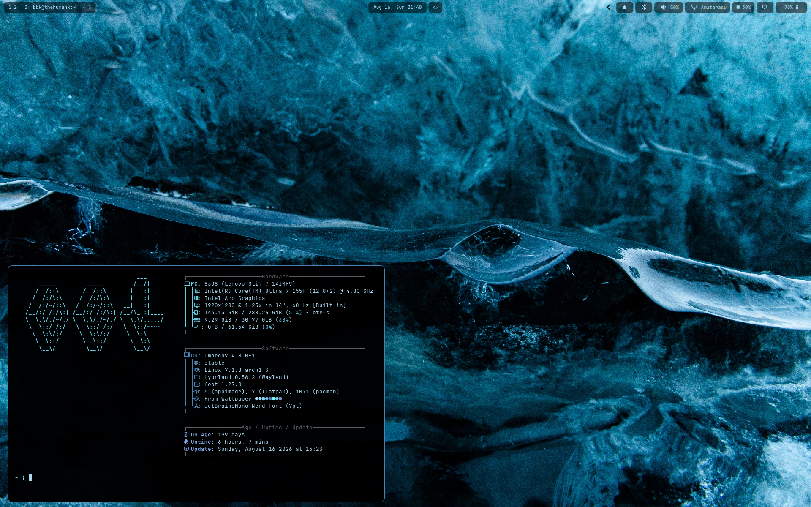
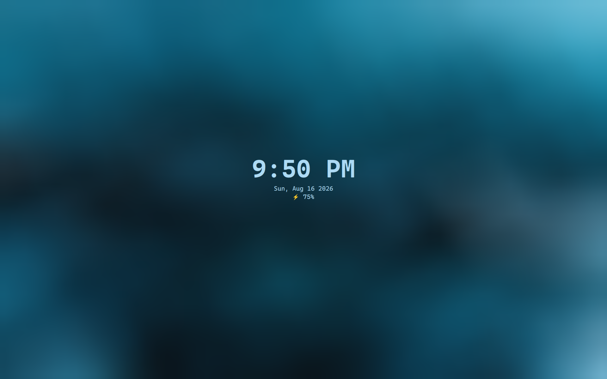

# bbk's Omarchy Setup

> A curated layer of customizations on top of [Omarchy Linux](https://omarchy.org/) by DHH —
> daily-driving Arch + Hyprland without the rough edges.



|  |
|:---:|
| Lock screen: time, date, battery — centered, password field hidden until typed |

---

## Why this exists

Stock Omarchy is already great — this isn't a case for replacing it, just for
tuning the handful of things that don't match how I actually use it:

- **I don't use themes.** Not Omarchy's built-in ones, not anyone else's. I
  change my wallpaper on a whim and want the whole system — bar, lock screen,
  terminal, everything — to just derive its colors from *that*, automatically,
  every time. That's what the wallpaper → theme pipeline is for: right-click
  an image, set it as background, done.
- **The stock lock screen isn't my taste.** Nothing wrong with it, it's just
  not what I want looking at me every time I unlock my laptop, so I rebuilt
  the layout (see the screenshot above).
- **The bar deserved a *little* ricing.** Not a redesign — same widgets,
  same layout mostly — just boxed pills with sane padding/gaps instead of
  bare icons floating on a transparent strip.
- **The cursor is purely subjective** — there's no reason to stick with the
  default when there are nicer ones out there. Afterglow is just the one I
  liked.

None of this is "Omarchy is missing something." It's "here's what *my*
Omarchy looks like," kept in a repo so it survives updates and reinstalls
instead of living only in my head.

Every change lives in `~/.config/` and **survives `omarchy update`** via a post-update hook.

---

## Omarchy 4 (current)

Omarchy 4 rewrote the whole shell in Lua/Quickshell — waybar, hyprlock, and mako are
gone, replaced by a built-in Quickshell bar, lock screen, and notification system.
Everything below this section targets **that** architecture. The "Legacy" sections
further down describe the pre-4 (waybar/hyprlock) setup and are kept only as
historical reference — most of it no longer applies.

### Keybindings & input (`configs/hypr/*.lua`)

- `bindings.lua` — personal overrides on top of Omarchy's Lua defaults: `Q`=close,
  `L`=system menu / `Shift+L`=workspace layout toggle, `E`=file manager,
  `;`=emoji picker, `Shift+S`/`Shift+R`=screenshot/recording, `Ctrl+Shift+S`=capture
  menu, `Super+Space`⇄`Super+Alt+Space` swapped (apps menu / omarchy menu), and a
  long list of unused preinstalled app/webapp shortcuts (Docker, Signal, ChatGPT,
  etc.) unbound.
- `input.lua` — natural scroll + 3-finger horizontal swipe to switch workspaces.
- `looknfeel.lua` — gaps 2/4, border 1px, rounded corners, `resize_on_border`,
  easier border-drag grab area. Border colors stay theme-tied (not hardcoded).
- `autostart.lua` — launches the wallpaper portal backend (see below).

### Wallpaper → theme pipeline

Nautilus "Set as Background" still has no native portal backend in Omarchy 4— same
gap as before, fixed the same way:

- `omarchy/wallpaper-portal.py` — a D-Bus service implementing
  `org.freedesktop.impl.portal.Wallpaper`, registered via
  `.local/share/xdg-desktop-portal/portals/omarchy.portal`. Routes
  `SetWallpaperURI` calls to `wallpaper-to-theme`. Autostarted from
  `hypr/autostart.lua`.
- `omarchy/wallpaper-to-theme` — generates a dedicated, self-contained Omarchy
  theme (`from-wallpaper`) via `aether --generate --no-apply` into its own theme
  directory, then applies it with `omarchy theme set`. Never mutates any other
  theme; regenerating on every wallpaper change just recreates this one theme.
  (The old version wrote directly into `~/.config/omarchy/current/theme` and drove
  a waybar/aether pipeline that no longer exists — this is a from-scratch rewrite
  for the new theme system, not a port.)

### Custom bar (`omarchy/plugins/bbk.*`)

Every bar widget is a clone of the stock Omarchy plugin (`omarchy plugin clone`),
kept independently editable and update-safe. Highlights:

- **Boxed modules** — each widget (workspaces, clock, weather, tray, agents,
  bluetooth, wifi, volume, memory, monitor, battery) sits in its own rounded pill
  with a solid theme-derived background (`Color.bar.background`/`Color.bar.text`,
  not a wallpaper-sampled tint — fixes inconsistent contrast on a transparent bar).
  4px corner radius, tuned inter-widget gap and internal padding.
- **`bbk.workspaces`** — focused workspace pill shows the number *and* the active
  window title inline, replacing the plain dot indicator.
- **`bbk.memory`** — new widget, RAM % with the same icon/style as the old waybar
  memory module; click opens `btop`.
- **`bbk.audio` / `bbk.network` / `bbk.bluetooth`** — icon + live label (volume %,
  connected SSID, connected device name), both icon and label clickable.
- **`bbk.lock`** — restyled Quickshell lock screen: time/date/battery centered,
  password field hidden until typed, no border, fully rounded. Only the visual
  layer (`LockView.qml`) is touched — the PAM/session-lock logic in `Service.qml`
  is untouched stock Omarchy.
- Bar height bumped via `omarchy/shell.toml` (`[bar] size-horizontal`) since the
  default shrinks with a smaller `[font] base-size`.

**Known limitation:** the top-level `bar` and `service` plugin kinds load
differently from `bar-widget`/`panel` kinds — cloning `omarchy.bar` itself
(to add a shared per-widget box wrapper) crashes with
`Required property ... was not initialized`. That's why the box styling is
duplicated per-widget instead of centralized.

### Cursor theme

Afterglow cursor (`configs/icons/Afterglow-cursors`), installed to
`~/.local/share/icons/`. Activated three ways so it actually sticks:
`gsettings set org.gnome.desktop.interface cursor-theme "Afterglow-cursors"`
(GTK apps), `hyprctl setcursor Afterglow-cursors 24` (live, current session),
and `XCURSOR_THEME`/`HYPRCURSOR_THEME`/`XCURSOR_SIZE`/`HYPRCURSOR_SIZE` env
vars in `hypr/looknfeel.lua` (persists across restarts — Hyprland has no
default `XCURSOR_THEME`, it falls through to GTK/whatever's on disk
otherwise). `recover-customizations.sh` runs all three.

### Idle / screensaver

Auto screensaver and auto-lock are **disabled entirely** — video (YouTube,
etc.) kept tripping the idle timeout even at normal (non-fullscreen) window
size, and `idle_inhibit` window rules only cover fullscreen. Simplest fix:
turn the whole idle cycle off via Omarchy's built-in toggle —

```bash
omarchy-shell idle disable   # persists to ~/.local/state/omarchy/indicators/stay-awake
omarchy-shell idle enable    # turn auto screensaver/lock back on
omarchy-shell idle status    # check current state
```

Manual lock (`Super+Ctrl+L`) is unaffected either way. The fullscreen
`idle_inhibit` rules below are harmless leftovers in case auto-lock ever
gets re-enabled — Steam/Moonlight/GeForce Now/browsers/mpv won't trip it
while fullscreen, same pattern Omarchy's own defaults already use for
games:

```lua
-- ~/.config/hypr/hyprland.lua
o.window({ tag = "chromium-based-browser" }, { idle_inhibit = "fullscreen" })
o.window({ tag = "firefox-based-browser" }, { idle_inhibit = "fullscreen" })
o.window("^(mpv)$", { idle_inhibit = "fullscreen" })
```

### Setup on a new Omarchy 4 machine

```bash
# Hyprland Lua overrides
cp configs/hypr/bindings.lua configs/hypr/input.lua configs/hypr/looknfeel.lua \
   configs/hypr/autostart.lua ~/.config/hypr/

# Bar layout + style tokens
cp configs/omarchy/shell.json configs/omarchy/shell.toml ~/.config/omarchy/

# Custom bar widgets + lock screen
mkdir -p ~/.config/omarchy/plugins
cp -r configs/omarchy/plugins/. ~/.config/omarchy/plugins/

# Wallpaper portal (Nautilus "Set as Background" → theme regen)
cp configs/omarchy/wallpaper-portal.py configs/omarchy/wallpaper-to-theme ~/.config/omarchy/
chmod +x ~/.config/omarchy/wallpaper-to-theme
mkdir -p ~/.local/share/xdg-desktop-portal/portals
cp configs/.local/share/xdg-desktop-portal/portals/omarchy.portal \
   ~/.local/share/xdg-desktop-portal/portals/

hyprctl reload
omarchy restart shell
```

> Validate any further Lua/QML edits with `hyprctl reload && hyprctl configerrors`
> (Hyprland) or `qmllint -I /usr/share/omarchy/shell <file>` plus
> `journalctl --user -t omarchy-shell` (shell plugins) before trusting a change.

---

## Legacy (pre-Omarchy-4)

> Everything from here down describes the **waybar/hyprlock/mako** era. Most of it
> was replaced wholesale by Omarchy 4's Quickshell shell and no longer applies —
> kept for historical reference only.

## What you get

### 🎨 One wallpaper. Every color. Everywhere.

Right-click any image in Nautilus → **Set as Background** → your entire desktop recolors itself.

<video src="images/wallpaper-demo.mp4" autoplay loop muted playsinline></video>

Aether extracts a 16-color palette from the image and propagates it to:

| Surface | What changes |
|---------|-------------|
| Hyprland borders | Active/inactive colors from the accent hue |
| Waybar pills | Background adapts to wallpaper brightness at the top of screen |
| Lock screen | Background, text, and input field colors |
| Mako notifications | Border and background colors |
| SwayOSD | Volume and brightness overlay colors |
| Terminals | Full 16-color ANSI palette (alacritty, ghostty, kitty, foot) |
| btop | Resource monitor theme |
| VSCode / Cursor | Matching color theme installed and activated |
| Obsidian / Zed / Browser | Accent and background synced |

The Waybar pill background is especially smart: it measures the **luminosity of the top 60px strip** of your wallpaper and picks a readable background — dark tinted pill on bright wallpapers, softer background on dark ones. No more unreadable white text on a white sky.

> **Under the hood:** Nautilus 50 uses the XDG Desktop Portal to change wallpapers, but Hyprland ships no Wallpaper portal backend. This setup adds one — a small Python D-Bus service that intercepts the call and routes it through the color pipeline.

---

> **Battery/TLP tuning removed (2026-08-16):** not in use right now. If it comes
> back, it'll be added fresh in a newer version rather than restored from here.

### ✋ Touchpad that gets out of your way

| Gesture | Action |
|---------|--------|
| 3-finger swipe left/right | Switch workspaces |
| 4-finger swipe up/down | Volume up/down |
| Natural scroll | On by default |

Scroll factor, tap-to-click, and drag latency all tuned for a 13" laptop.

---

### 💊 Waybar that earns its 30px

Stock Omarchy's bar is minimal. This one carries its weight:

```
[  Window title                    ] [media] [bt] [🔔] [ net ] [mem] [⚡] [🔋] [tray]
```

- **Window title** in the left — always know what's focused
- **Media module** — current track + playback controls, hidden when nothing's playing
- **Bluetooth** — live on/off state with toggle
- **Notification counter** — unread count with Mako integration  
- **Net speed** — live upload/download in the tray area
- **Power mode indicator** — icon changes with the active TLP mode; tooltip shows actual screen-on time since last unplug (excludes sleep/idle, like Android SOT)
- **Battery** — percentage + charging state, color-coded (charging=green, full=blue)
- **Each module is a floating pill** — semi-transparent, 8px radius, wallpaper-aware background color

---

### 🔔 Notifications that look right

Mako notifications match the window border radius (8px rounded corners). Click to act on a notification (e.g. open screenshot in editor), right-click to dismiss instantly. Colors (border, background) are wallpaper-derived like everything else.

---

### 🔒 Lock screen worth looking at

Clock, date, and battery percentage displayed. Fingerprint authentication works out of the box. Screen never auto-locks mid-video — locking is always intentional (`Ctrl+L`).

Custom TTE screensaver (`Ctrl+Super+S`) fades into the lock screen on exit rather than cutting hard.

---

### ⌨️ Keybinds that make sense

| Keybind | Action |
|---------|--------|
| `Super+Q` | Close window |
| `Super+L` | System menu (lock/shutdown/reboot) |
| `Super+E` | File manager |
| `Super+;` | Emoji picker |
| `Super+Shift+S` | Screenshot |
| `Super+Shift+R` | Screen recording |
| `Super+Shift+P` | Cycle power mode |
| `Super+Shift+B` | Browser |
| `Super+Shift+M` | Music (Spotify) |
| `Super+Shift+N` | Editor |
| Brightness keys | 1% precision steps |
| Volume keys | 5% steps via SwayOSD |

---

### 🖥️ The small things that add up

- **Afterglow cursor theme** — sleek dark cursor that doesn't disappear on light backgrounds
- **Bluetooth state persists** across reboots — if it was off, it stays off
- **Power mode persists** — wake up in the mode you left
- **Tighter window gaps** — 2px inner / 4px outer (stock: 5/10), more screen real estate
- **Shadows off on battery** — reduces GPU compositing overhead transparently
- **Force shutdown** — instant kill when a normal shutdown hangs (bound in the system menu)
- **WiFi power save fix** — re-enables WiFi properly after waking from suspend (no more "operation failed")
- **`resize_on_border`** — drag any window edge to resize, not just the title bar
- **Web apps open in Vivaldi** — `omarchy-launch-webapp` falls back to Vivaldi (not missing Chromium) for Google Photos, Maps, Messages, WhatsApp, Figma

---

## What's different from stock

### Hyprland

| Config | Stock Omarchy | This setup |
|--------|---------------|------------|
| `omarchy-launch-webapp` | Falls back to chromium | Falls back to vivaldi-stable (chromium not installed) |
| `omarchy-brightness-display` | Dispatches dpms off/on | Same + signals SOT daemon pipe |
| `autostart.conf` | Generic startup | Restores power mode + bluetooth state; starts wallpaper portal |
| `bindings.conf` | Default keybinds | Q=close, L=menu, E=files, ;=emoji, Shift+S=screenshot, Shift+R=recording, Shift+P=power mode, 1% brightness, 5% volume |
| `hypridle.conf` | Auto-screensaver + lock timers | No auto timers — manual lock only |
| `hyprlock.conf` | Theme defaults | Clock, date, battery; fingerprint auth |
| `input.conf` | Basic touchpad | Natural scroll, 3-finger workspace, 4-finger volume |
| `looknfeel.conf` | gaps=5/10, border=2, shadows on | gaps=2/4, border=1, shadows off on battery, resize_on_border, 20+ animation curves |
| `border-colors.conf` | None | Generated from wallpaper accent; active + 40%-dim inactive |
| `monitors.conf` | No default | Scale 1.15 for 13" 2.8K (GDK_SCALE=2) |
| `hyprland.conf` | Sources stock looknfeel | Sources custom looknfeel; Afterglow cursor |

### Waybar

| Config | Stock Omarchy | This setup |
|--------|---------------|------------|
| `config.jsonc` | omarchy icon + workspaces, cpu + battery | Window title, 10 center modules, tray + memory + power-mode + battery |
| `style.css` | Solid bar background | Transparent bar, floating pills per module, wallpaper-aware background |
| `dynamic.css` | None | Generated per wallpaper: `@accent`, `@module-bg` |
| `indicators/` | Minimal | TLP power mode (with Android-style SOT), bluetooth state, media (playerctl), battery |

### System

| Feature | Stock Omarchy | This setup |
|---------|---------------|------------|
| Wallpaper → theme | Manual `omarchy theme set` | Automatic on "Set as Background" in Nautilus |
| Battery tuning | None | TLP + sysctl + THP madvise |
| Power profiles | None | 3-mode with Waybar indicator + keybind |
| Shutdown | Standard systemd | + force-kill option for hangs |
| Cursor | Default | Afterglow dark theme |
| Notifications | Default mako | Rounded corners (8px), click to act, right-click to dismiss |
| SOT tracking | None | Event-driven daemon via named pipe; instant, zero polling overhead |
| Sleep hook | None | Banks screen time before suspend, resumes after wake |

---

## Structure

```
omarchy-setup/
├── configs/
│   ├── hypr/               # bindings.lua, input.lua, looknfeel.lua, autostart.lua (Omarchy 4)
│   │                       # + legacy *.conf files (pre-4, reference only)
│   ├── waybar/             # LEGACY — bar config + indicators/ + dynamic.css (pre-4)
│   ├── icons/              # Afterglow cursor theme
│   ├── xdg-desktop-portal/ # Portal routing (adds omarchy wallpaper backend)
│   ├── omarchy/
│   │   ├── plugins/bbk.*/  # Omarchy 4 custom shell plugins (bar widgets + lock screen)
│   │   ├── shell.json      # Omarchy 4 bar layout (widget order, per-widget settings)
│   │   ├── shell.toml      # Omarchy 4 style tokens (bar size, font scale overrides)
│   │   ├── wallpaper-portal.py   # D-Bus service: Nautilus → wallpaper-to-theme
│   │   ├── wallpaper-to-theme    # Omarchy 4: aether --generate → omarchy theme set
│   │   ├── bin/            # Omarchy bin overrides (webapp launcher, brightness-display)
│   │   ├── branding/       # ASCII art (about, screensaver text)
│   │   ├── extensions/     # System menu overrides (force shutdown)
│   │   ├── hooks/          # post-update + theme-set hooks
│   │   └── bluetooth-state.sh
│   ├── system-tweaks/      # force-shutdown.sh, logind.conf
│   ├── system-sleep/       # sot-hook.sh (sudo install: /etc/systemd/system-sleep/)
│   ├── systemd/user/       # Custom user services (sot-daemon.service)
│   ├── opencode/           # opencode config (memory plugin)
│   └── .local/
│       ├── bin/            # LEGACY — border-from-wallpaper, wallpaper-to-theme (pre-4), sot-daemon
│       └── share/xdg-desktop-portal/portals/  # omarchy.portal registration (current)
├── scripts/
│   └── sync-configs.sh     # Pull live configs back into repo
├── restore-customizations.hook  # Post-update hook source — install via
│                                 # `omarchy hook install post-update <file>`
├── recover-customizations.sh    # Manual restore / new machine setup
└── images/                 # Screenshots
```

---

## Prerequisites

```bash
# Media + notifications
sudo pacman -S playerctl mako pamixer libnotify jq

# Bluetooth
sudo pacman -S bluez bluez-utils

# Printing status indicator
sudo pacman -S cups

# Wallpaper-driven theming
sudo pacman -S imagemagick python-dbus python-gobject
# aether ships with Omarchy — no separate install needed

# Screensaver
pip install terminaltexteffects
```

**Python path** (if `terminaltexteffects` was installed under a different Python version):
```bash
# Add to ~/.config/hypr/scripts/custom-screensaver-launch.sh
export PYTHONPATH="/usr/lib/python3.13/site-packages:$PYTHONPATH"
```

---

## Setup on a new machine

`recover-customizations.sh` handles everything below in the right order —
Hyprland Lua config, the bar/lock-screen plugins, wallpaper portal, cursor
theme, SOT daemon, and installing the post-update hook properly via
`omarchy hook install`:

```bash
git clone <repo> ~/omarchy-setup
cd ~/omarchy-setup
./recover-customizations.sh

# Not auto-installed (needs sudo):
sudo cp configs/system-sleep/sot-hook.sh /etc/systemd/system-sleep/
sudo chmod +x /etc/systemd/system-sleep/sot-hook.sh

hyprctl reload && hyprctl configerrors
omarchy restart shell
```

---

## Daily workflow

```bash
# Make a change, test it, sync back to repo, commit
vim ~/.config/omarchy/plugins/bbk.clock/BarWidget.qml
# test with: qmllint -I /usr/share/omarchy/shell <file>
# then: omarchy restart shell && journalctl --user -t omarchy-shell --since "-30 seconds"
~/omarchy-setup/scripts/sync-configs.sh
cd ~/omarchy-setup && git add -A && git commit -m "..." && git push
```

Before running `omarchy update`, do a quick `sync-configs.sh` as a snapshot.
The `restore-customizations.hook` post-update hook (installed via
`omarchy hook install post-update`) restores everything automatically after
an update, and **flags a warning if the update changed something this repo
also manages** rather than silently overwriting it — check for `⚠ DRIFT`
lines in the post-update output and fold in anything worth keeping.
